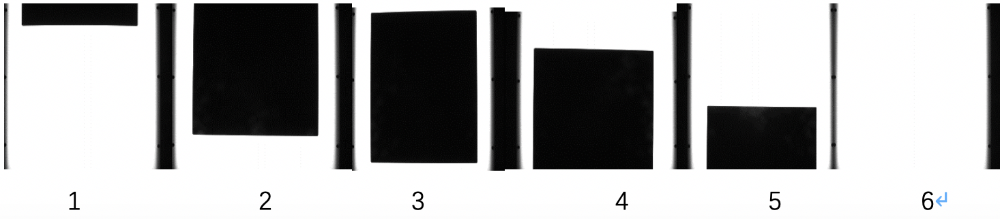

### 1 Overview
- This project aims at detecting the silicon slice, deciding whether the slice, over conveyor belt in factory, accords with the production specification(C++, Opencv)
- In order to process the image we import OpenCv lib.

### 2 Configure opencv environment in Xcode
1. use homebrew to install opencv
brew install opencv
2. Find 'Header Search Path' in 'Buid Setting' in Xcode, then add the head file link to there /usr/local/Cellar/opencv/4.2.0_1/include/opencv4
3. Find 'Linked Frameworks abd Libraries' in 'General', add *.dylib files to there in /usr/local/Cellar/opencv/4.2.0_1/lib 

### 3 Detection steps
In the factory, the silicon slice is conveyed by the conveyor belt. Above the belt is a camera. 
1. check the position of the silicon slice
the slice may have 6 types of positions, as is shown in the following table:
|top|middle|bottom|returned value|types|
|:-:|:-:|:-:|:-:|
|1|0|0|1|1|
|1|1|0|2|2|
|0|1|0|3|3|
|0|1|1|4|4|
|0|0|1|5|5|
|0|0|0|6|6|

So when the camera shoots a pic and input it into the system, if the pic is type 1-3, then we get into the next step, else we don't have to check since the silicon slice is conveyed on the belt from top to bottom. So we can know whether the slice has problems just by checking the type 1-3 pics.
2. get the left edge and right edge
we can see black pixel in the right and left edge. These edges will affect our detection. So we should decide the start point of detecting the boundary edge.
3. get the coordinates of all four vertexes
if pos = 1, then we can get the top vertexes' coordinates easily. and then get the bottom twos
if pos = 2, it's similar
if pos = 3, it became complex. First, we should detect the top vertex. if we first get the right top vertex, then we know the slice is rotating counterclockwise; if we first get the left top vertex, then we know the slice is rotating clockwise. According to different conditions, we use different methods to get all these vertexes.
4. calculate the length of each side
we have already get the four vertexes, so we can use them to calculate the length of each side. e.g. topLength = length(topRightV) - length(topLeftV)

